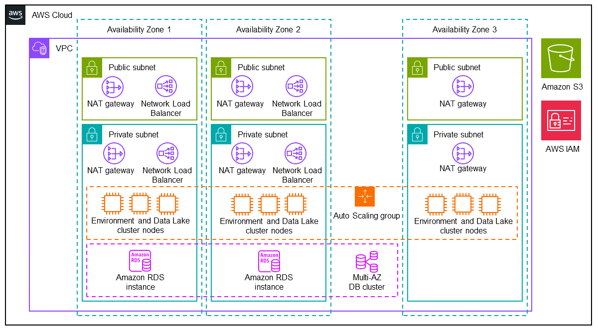
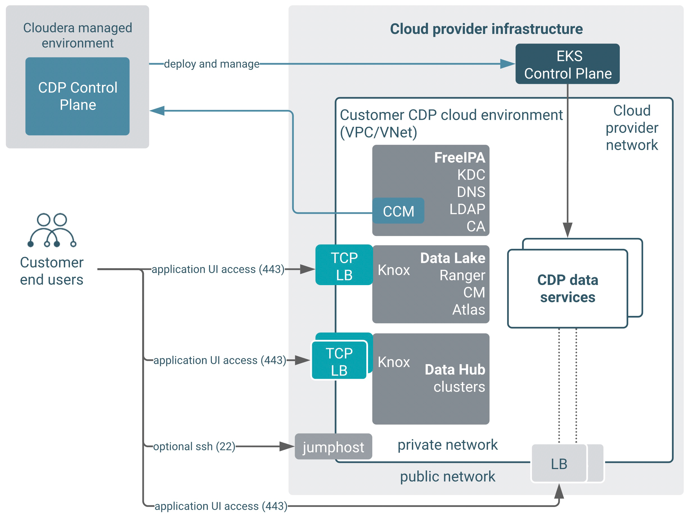

# CDP Public Cloud Partner Solution on AWS—Terraform module

This Amazon Web Services (AWS) Partner Solution uses a [Terraform module](https://registry.terraform.io/modules/aws-ia/<path>/latest) to deploy the Cloudera Data Platform (CDP) Public Cloud, an integrated analytics and data management platform in the AWS Cloud. CDP offers broad data analytics and artificial intelligence functionality along with secure user access and data governance features.

For more information, refer to the [CDP Public Cloud documentation](https://docs.cloudera.com/cdp-public-cloud/cloud/overview/topics/cdp-public-cloud.html).

This Partner Solution was developed by Cloudera in collaboration with AWS. Cloudera is an [AWS Partner](https://partners.amazonaws.com/partners/001E000000dHiGgIAK/Cloudera,%20Inc). Amazon may share user-deployment information with the AWS Partner that collaborated with AWS on this solution.  

## Costs and licenses

To use CDP Public Cloud, you must have a license. For more information, refer to [Try CDP Public Cloud](https://www.cloudera.com/campaign/try-cdp-public-cloud.html).

There is no cost to use this Partner Solution, but you'll be billed for any AWS services or resources that this Partner Solution deploys. For more information, refer to the [AWS Partner Solution General Information Guide](https://fwd.aws/rA69w?).

## Authors and Contributors

Battulga Purevragchaa (AWS), Nidhi Gupta (AWS), Jim Enright (Cloudera), Webster Mudge (Cloudera), Adrian Castello (Cloudera), Balazs Gaspar (Cloudera)

## Architecture

This Partner Solution deploys into a new virtual private cloud (VPC) or into an existing VPC.



As shown in the diagram, this solution sets up the following:

* A highly available architecture that spans three Availability Zones.
* A virtual private cloud (VPC) configured with public and private subnets, according to AWS best practices, to provide you with your own virtual network on AWS.*
* In the public subnets:
    * Managed NAT gateways for outbound traffic (one per subnet).*
    * Network Load Balancers for routing external traffic to specific target groups (UI and API endpoints in the private subnets).**
    * An internet gateway to allow outbound traffic (one per deployment) (not shown).*
* In the private subnets:
    * Managed NAT gateways for outbound traffic (one per subnet).*
    * Network Load Balancers for routing internal traffic to specific target groups (typically API endpoints in the private subnets).**
    * Auto Scaling groups for the following:
       * CDP [environment](https://docs.cloudera.com/management-console/cloud/environments/topics/mc-environments.html) (one scaling group).**
       * [Data Lake](https://docs.cloudera.com/management-console/cloud/data-lakes/topics/mc-data-lake.html) (one scaling group per host group, a total of five).**
       * [Data Hub](https://docs.cloudera.com/data-hub/cloud/index.html) (one scaling group per host group, total number depends on Data Hub configuration) (not shown).***
    * One Amazon RDS for PostgreSQL multi-AZ database cluster with two instances (used by the CDP Data Lake).**
* Two AWS security groups [as required by CDP](https://docs.cloudera.com/cdp-public-cloud/cloud/requirements-aws/topics/mc-aws-req-security-groups.html) (not shown).
* A [cross-account role](https://docs.cloudera.com/cdp-public-cloud/cloud/requirements-aws/topics/mc-aws-req-credential.html) and an attached cross-account policy providing access to the AWS Cloud account from your [CDP Management Console](https://docs.cloudera.com/management-console/cloud/overview/topics/mc-management-console.html) (not shown). 
* Various IAM roles, policies, and instance profiles for configuring fine-grain permission for [cloud storage access](https://docs.cloudera.com/cdp-public-cloud/cloud/requirements-aws/topics/mc-idbroker-minimum-setup.html) and AWS compute services (not shown). 
* An Amazon Simple Storage Service (Amazon S3) bucket with three default locations for storing data, table metadata, logs, and audit.

*If you configure the module to deploy the Partner Solution into an existing VPC, the deployment skips the components marked by a single asterisk.
**The components marked by double asterisks are created by CDP, and are not created directly by the Terraform module that deploys this solution. These components are created when called by the CDP provider in the second stage of deploying this solution. (The creation requests come from the CDP control plane.)
***The components marked by triple asterisks are created by CDP. These components are optional and can be created using the CDP UI.

The `ex01-minimal-inputs` example implements a semi-private reference architecture of CDP. This deploys customer workloads to private subnets, but exposes CDP service endpoints, which data consumers can access over a load balancer with a public IP address. Security groups or allow-lists (IP addresses or CIDR) on Load Balancers must be used to restrict access to these public services only to corporate networks as needed.

A detailed description of this setup is available under the Cloudera [Public Endpoint Access Gateway](https://docs.cloudera.com/management-console/cloud/connection-to-private-subnets/topics/mc-endpoint_access_gateway.html) documentation. This setup provides a balance between security and ease of use. **For secure deployments, we recommend [private setups](https://docs.cloudera.com/cdp-public-cloud/cloud/aws-refarch/topics/cdp-pc-aws-refarch-taxonomy.html#cdp_pc_aws_architecture_taxonomy) without assigning public IP addresses / providing direct access from the internet to the subnets used by CDP.**

The various network flows in this architecture are depicted in the diagram below:



## Prerequisites

To use the module provided here, you must have the required accounts and software.

* An AWS account (for an evaluation or PoC we recommend using a dedicated AWS account for CDP).
* A CDP Public Cloud account.
* A recent version of Terraform software (version 0.13 or higher).

Before you deploy this solution, you must provide these variables:

* `env_prefix` - A string prefix that is used to name the cloud provider and CDP resources created.
* `aws_region` - The AWS Region in which the cloud prerequisites and CDP are deployed. For example, eu-west-1. For a list of supported AWS Regions, see Supported AWS Regions.
* `aws_key_pair` - The name of an AWS keypair that exists in your account in the selected region.
* `deployment_template` - The selected deployment pattern. Values allowed: `private`, `semi-private` and `public`. (The diagrams in this readme illustrate the `semi-private` setup of CDP Public Cloud on AWS.)
* `ingress_extra_cidrs_and_ports` - Inbound access to the UI and API endpoints of your deployment that are allowed from the CIDRs (IP ranges) and ports specified here.

## Usage

### Configure local prerequisites

1. You must configure your AWS credentials locally so Terraform can find them. For examples on how to configure the required environment variables, refer to [Build Infrastructure | Terraform | HashiCorp Developer](https://developer.hashicorp.com/terraform/tutorials/aws-get-started/aws-build).
2. If you have not yet configured your `~/.cdp/credentials file`, follow the steps for [Generating an API access key](https://docs.cloudera.com/cdp-public-cloud/cloud/cli/topics/mc-cli-generating-an-api-access-key.html).
3. To install Terraform, refer to the official Hashicorp guide [Install Terraform](https://developer.hashicorp.com/terraform/tutorials/aws-get-started/install-cli).

### Create infrastructure

1. Clone this repository using the following commands:

```bash
git clone https://github.com/aws-ia/terraform-cloudera-cdp.git  
cd terraform-cloudera-cdp
```

2. Choose one of the deployment types in the [examples](./examples) directory and change to this directory.

```bash
cd examples/ex<deployment_type>/
```

3. Create a `terraform.tfvars` file with variable definitions to run the module. Reference the `terraform.tfvars.sample` file in each example folder to create this file (or simply rename it and change the values for the input variables).

4. Run the Terraform module for the chosen deployment type:

```bash
terraform init
terraform apply
```

5. Once the creation of the CDP environment and Data Lake starts, you can follow the deployment process on the CDP Management Console from your browser in ([https://cdp.cloudera.com/](https://cdp.cloudera.com/)). After it completes, you can add CDP [Data Hubs and Data Services](https://docs.cloudera.com/cdp-public-cloud/cloud/overview/topics/cdp-services.html) to your newly deployed environment from the Management Console UI or use the CLI.

### Clean up the infrastructure

If you no longer need the infrastructure that’s provisioned by the Terraform module, run the following command (from the same working directory) to remove the deployment infrastructure and terminate all resources.

```bash
terraform destroy
```


## Customer responsibility

After you deploy this Partner Solution, confirm that your resources and services are updated and configured–including any required patches—to meet your security and other needs. For more information, refer to the [AWS Shared Responsibility Model](https://aws.amazon.com/compliance/shared-responsibility-model/).
