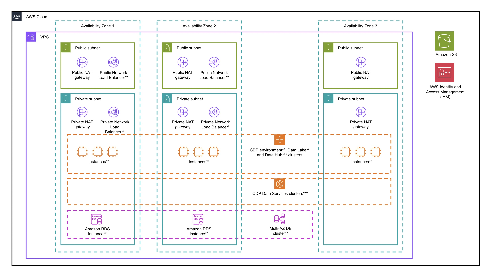
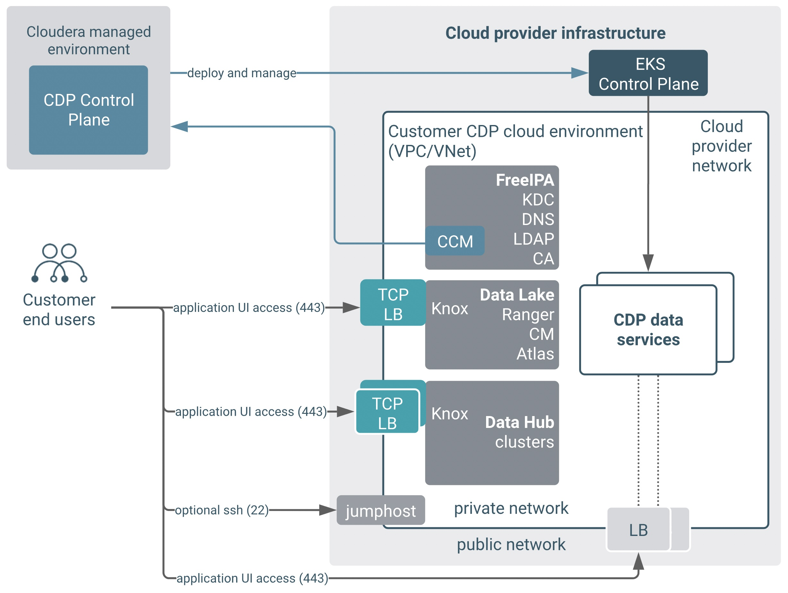

<!-- BEGIN_TF_DOCS -->
# CDP Public Cloud Partner Solution on AWS—Terraform module

This Amazon Web Services (AWS) Partner Solution uses a [Terraform module](https://registry.terraform.io/modules/aws-ia/<path>/latest) to deploy the Cloudera Data Platform (CDP) Public Cloud, an integrated analytics and data management platform in the AWS Cloud. CDP offers broad data analytics and artificial intelligence functionality along with secure user access and data governance features.

For more information, refer to the [CDP Public Cloud documentation](https://docs.cloudera.com/cdp-public-cloud/cloud/overview/topics/cdp-public-cloud.html).

This Partner Solution was developed by Cloudera in collaboration with AWS. Cloudera is an [AWS Partner](https://partners.amazonaws.com/partners/001E000000dHiGgIAK/Cloudera,%20Inc). Amazon may share user-deployment information with the AWS Partner that collaborated with AWS on this solution.  

## Costs and licenses

To use CDP Public Cloud, you must have a license. For more information, refer to [Try CDP Public Cloud](https://www.cloudera.com/campaign/try-cdp-public-cloud.html).

There is no cost to use this Partner Solution, but you'll be billed for any AWS services or resources that this Partner Solution deploys. For more information, refer to the [AWS Partner Solution General Information Guide](https://fwd.aws/rA69w?).

## Authors and Contributors

Battulga Purevragchaa (AWS), Nidhi Gupta (AWS), Jim Enright (Cloudera), Webster Mudge (Cloudera), Adrian Castello (Cloudera), Balazs Gaspar (Cloudera)

## Architecture

This Partner Solution deploys into a new virtual private cloud (VPC) or into an existing VPC.



As shown in the diagram, this solution sets up the following:

* A highly available architecture that spans three Availability Zones.
* A VPC configured with public and private subnets, according to AWS best practices, to provide you with your own virtual network on AWS.*

* In the public subnets:
    * Public NAT Gateways for outbound traffic (one per subnet).*
    * Public Network Load Balancers for routing external traffic to specific target groups (UI and API endpoints in the private subnets).**
    * An Internet Gateway to allow outbound traffic (one per deployment). (not shown)*

* In the private subnets:
    * Private NAT Gateways for outbound traffic (one per subnet).*
    * Private Network Load Balancers for routing internal traffic to specific target groups (typically API endpoints in the private subnets).**
    * Auto Scaling groups for the following:
       * CDP [environment](https://docs.cloudera.com/management-console/cloud/environments/topics/mc-environments.html) (one scaling group).**
       * [data lake](https://docs.cloudera.com/management-console/cloud/data-lakes/topics/mc-data-lake.html) (one scaling group per host group, a total of five)**
       * [data hub](https://docs.cloudera.com/data-hub/cloud/index.html) (one scaling group per host group, total number depends on Data Hub configuration) (not shown)***
    * One Amazon RDS for PostgreSQL multi-AZ database cluster with two instances (used by the CDP data lake).**

* Two AWS security groups [as required by CDP](https://docs.cloudera.com/cdp-public-cloud/cloud/requirements-aws/topics/mc-aws-req-security-groups.html). (not shown)
* A [cross-account role](https://docs.cloudera.com/cdp-public-cloud/cloud/requirements-aws/topics/mc-aws-req-credential.html) and an attached cross-account policy providing access to the AWS Cloud account from your  [CDP Management Console](https://docs.cloudera.com/management-console/cloud/overview/topics/mc-management-console.html). (not shown)
* Various IAM roles, policies and instance profiles for configuring fine-grain permission for [cloud storage access](https://docs.cloudera.com/cdp-public-cloud/cloud/requirements-aws/topics/mc-idbroker-minimum-setup.html) and AWS compute services. (not shown)
* An AWS S3 bucket with three default locations for storing data, table metadata, logs and audit.

*If you configure the module to deploy the Partner Solution into an existing VPC, the deployment skips the components marked by asterisks.

**The components marked by a double asterisk are created by CDP, and are not created directly by the Terraform module that deploys this solution. These components are created when called by the CDP provider in the second stage of deploying this solution. (The creation requests come from the CDP control plane.)

***The components marked by a triple asterisk are created by CDP. These components are optional and could be created using the CDP UI.

The `ex01-minimal-inputs` example implements a semi-private reference architecture of CDP. This deploys customer workloads to private subnets, but exposes CDP service endpoints, which data consumers can access over a load balancer with a public IP address. Security groups or allow-lists (IP addresses or CIDR) on Load Balancers must be used to restrict access to these public services only to corporate networks as needed.

A detailed description of this setup is available under the Cloudera  [Public Endpoint Access Gateway](https://docs.cloudera.com/management-console/cloud/connection-to-private-subnets/topics/mc-endpoint_access_gateway.html) documentation. This setup provides a balance between security and ease of use. **For secure deployments, we recommend [private setups](https://docs.cloudera.com/cdp-public-cloud/cloud/aws-refarch/topics/cdp-pc-aws-refarch-taxonomy.html#cdp_pc_aws_architecture_taxonomy) without assigning public IP addresses / providing direct access from the internet to the subnets used by CDP.**

The various network flows in this architecture are depicted in the diagram below:



## Prerequisites

To use the module provided here, you will need the following prerequisites:

* An AWS account (for an evaluation or PoC we recommend using a dedicated AWS account for CDP)
* A CDP Public Cloud account
* A recent version of Terraform software (version 0.13 or higher)

Before you deploy this solution, you must provide these variables:

* `env_prefix` - A string prefix that will be used to name the cloud provider and CDP resources created.
* `aws_region` - The AWS region in which the cloud prerequisites and CDP will be deployed. For example, eu-west-1. For a list of supported AWS regions, see Supported AWS regions.
* `aws_key_pair` - The name of an AWS keypair that exists in your account in the selected region.
* `deployment_template` - The selected deployment pattern. Values allowed: `private`, `semi-private` and `public`. (The diagrams in this readme illustrate the `semi-private` setup of CDP Public Cloud on AWS.)
* `ingress_extra_cidrs_and_ports` - Inbound access to the UI and API endpoints of your deployment will be allowed from the CIDRs (IP ranges) and ports specified here.

## Usage

### Configure local prerequisites

1. You will need to configure your AWS credentials locally so that Terraform can find them. Examples are shown in  [Build Infrastructure | Terraform | HashiCorp Developer](https://developer.hashicorp.com/terraform/tutorials/aws-get-started/aws-build) on how to configure the required environment variables.
2. If you have not yet configured your `~/.cdp/credentials file`, follow the steps for [Generating an API access key](https://docs.cloudera.com/cdp-public-cloud/cloud/cli/topics/mc-cli-generating-an-api-access-key.html).
3. To install Terraform follow the official  [Install Terraform](https://developer.hashicorp.com/terraform/tutorials/aws-get-started/install-cli) guide from Hashicorp.

### Create infrastructure

1. Clone this repository using the following commands:

```bash
git clone https://github.com/aws-ia/terraform-cloudera-cdp.git  
cd terraform-cloudera-cdp
```

2. Choose one of the deployment types in the [examples](./examples) directory and change to this directory.

```bash
cd examples/ex<deployment_type>/
```

3. Create a `terraform.tfvars` file with variable definitions to run the module. Reference the `terraform.tfvars.sample` file in each example folder to create this file (or simply rename it and change the values for the input variables).

4. Run the Terraform module for the chosen deployment type:

```bash
terraform init
terraform apply
```

5. Once the creation of the CDP environment and data lake starts, you can follow the deployment process on the CDP Management Console from your browser in ( [https://cdp.cloudera.com/](https://cdp.cloudera.com/) ). After it completes, you can add CDP  [Data Hubs and Data Services](https://docs.cloudera.com/cdp-public-cloud/cloud/overview/topics/cdp-services.html) to your newly deployed environment from the Management Console UI or using the CLI.

### Clean up the infrastructure

If you no longer need the infrastructure that’s provisioned by the Terraform module, run the following command (from the same working directory) to remove the deployment infrastructure and terminate all resources.

```bash
terraform destroy
```

## Customer responsibility

After you deploy this Partner Solution, confirm that your resources and services are updated and configured—including any required patches—to meet your security and other needs. For more information, refer to the [AWS Shared Responsibility Model](https://aws.amazon.com/compliance/shared-responsibility-model/).

## Requirements

| Name | Version |
|------|---------|
| <a name="requirement_terraform"></a> [terraform](#requirement\_terraform) | > 1.3.0 |
| <a name="requirement_aws"></a> [aws](#requirement\_aws) | 4.67.0 |
| <a name="requirement_cdp"></a> [cdp](#requirement\_cdp) | 0.1.3-pre |
| <a name="requirement_http"></a> [http](#requirement\_http) | 3.2.1 |
| <a name="requirement_random"></a> [random](#requirement\_random) | 3.4.3 |
| <a name="requirement_time"></a> [time](#requirement\_time) | 0.9.1 |

## Providers

| Name | Version |
|------|---------|
| <a name="provider_aws"></a> [aws](#provider\_aws) | 4.67.0 |
| <a name="provider_cdp"></a> [cdp](#provider\_cdp) | 0.1.3-pre |
| <a name="provider_http"></a> [http](#provider\_http) | 3.2.1 |
| <a name="provider_random"></a> [random](#provider\_random) | 3.4.3 |
| <a name="provider_time"></a> [time](#provider\_time) | 0.9.1 |

## Modules

| Name | Source | Version |
|------|--------|---------|
| <a name="module_aws_cdp_vpc"></a> [aws\_cdp\_vpc](#module\_aws\_cdp\_vpc) | ./modules/vpc | n/a |

## Resources

| Name | Type |
|------|------|
| [aws_iam_instance_profile.cdp_datalake_admin_role_instance_profile](https://registry.terraform.io/providers/hashicorp/aws/4.67.0/docs/resources/iam_instance_profile) | resource |
| [aws_iam_instance_profile.cdp_idbroker_role_instance_profile](https://registry.terraform.io/providers/hashicorp/aws/4.67.0/docs/resources/iam_instance_profile) | resource |
| [aws_iam_instance_profile.cdp_log_role_instance_profile](https://registry.terraform.io/providers/hashicorp/aws/4.67.0/docs/resources/iam_instance_profile) | resource |
| [aws_iam_instance_profile.cdp_ranger_audit_role_instance_profile](https://registry.terraform.io/providers/hashicorp/aws/4.67.0/docs/resources/iam_instance_profile) | resource |
| [aws_iam_policy.cdp_bucket_data_access_policy](https://registry.terraform.io/providers/hashicorp/aws/4.67.0/docs/resources/iam_policy) | resource |
| [aws_iam_policy.cdp_datalake_admin_s3_data_access_policy](https://registry.terraform.io/providers/hashicorp/aws/4.67.0/docs/resources/iam_policy) | resource |
| [aws_iam_policy.cdp_datalake_backup_policy](https://registry.terraform.io/providers/hashicorp/aws/4.67.0/docs/resources/iam_policy) | resource |
| [aws_iam_policy.cdp_datalake_restore_policy](https://registry.terraform.io/providers/hashicorp/aws/4.67.0/docs/resources/iam_policy) | resource |
| [aws_iam_policy.cdp_idbroker_policy](https://registry.terraform.io/providers/hashicorp/aws/4.67.0/docs/resources/iam_policy) | resource |
| [aws_iam_policy.cdp_log_data_access_policy](https://registry.terraform.io/providers/hashicorp/aws/4.67.0/docs/resources/iam_policy) | resource |
| [aws_iam_policy.cdp_ranger_audit_s3_data_access_policy](https://registry.terraform.io/providers/hashicorp/aws/4.67.0/docs/resources/iam_policy) | resource |
| [aws_iam_policy.cdp_xaccount_policy](https://registry.terraform.io/providers/hashicorp/aws/4.67.0/docs/resources/iam_policy) | resource |
| [aws_iam_role.cdp_datalake_admin_role](https://registry.terraform.io/providers/hashicorp/aws/4.67.0/docs/resources/iam_role) | resource |
| [aws_iam_role.cdp_idbroker_role](https://registry.terraform.io/providers/hashicorp/aws/4.67.0/docs/resources/iam_role) | resource |
| [aws_iam_role.cdp_log_role](https://registry.terraform.io/providers/hashicorp/aws/4.67.0/docs/resources/iam_role) | resource |
| [aws_iam_role.cdp_ranger_audit_role](https://registry.terraform.io/providers/hashicorp/aws/4.67.0/docs/resources/iam_role) | resource |
| [aws_iam_role.cdp_xaccount_role](https://registry.terraform.io/providers/hashicorp/aws/4.67.0/docs/resources/iam_role) | resource |
| [aws_iam_role_policy_attachment.cdp_datalake_admin_role_attach1](https://registry.terraform.io/providers/hashicorp/aws/4.67.0/docs/resources/iam_role_policy_attachment) | resource |
| [aws_iam_role_policy_attachment.cdp_datalake_admin_role_attach2](https://registry.terraform.io/providers/hashicorp/aws/4.67.0/docs/resources/iam_role_policy_attachment) | resource |
| [aws_iam_role_policy_attachment.cdp_datalake_admin_role_attach3](https://registry.terraform.io/providers/hashicorp/aws/4.67.0/docs/resources/iam_role_policy_attachment) | resource |
| [aws_iam_role_policy_attachment.cdp_datalake_admin_role_attach4](https://registry.terraform.io/providers/hashicorp/aws/4.67.0/docs/resources/iam_role_policy_attachment) | resource |
| [aws_iam_role_policy_attachment.cdp_idbroker_role_attach1](https://registry.terraform.io/providers/hashicorp/aws/4.67.0/docs/resources/iam_role_policy_attachment) | resource |
| [aws_iam_role_policy_attachment.cdp_idbroker_role_attach2](https://registry.terraform.io/providers/hashicorp/aws/4.67.0/docs/resources/iam_role_policy_attachment) | resource |
| [aws_iam_role_policy_attachment.cdp_log_role_attach1](https://registry.terraform.io/providers/hashicorp/aws/4.67.0/docs/resources/iam_role_policy_attachment) | resource |
| [aws_iam_role_policy_attachment.cdp_log_role_attach2](https://registry.terraform.io/providers/hashicorp/aws/4.67.0/docs/resources/iam_role_policy_attachment) | resource |
| [aws_iam_role_policy_attachment.cdp_log_role_attach3](https://registry.terraform.io/providers/hashicorp/aws/4.67.0/docs/resources/iam_role_policy_attachment) | resource |
| [aws_iam_role_policy_attachment.cdp_ranger_audit_role_attach1](https://registry.terraform.io/providers/hashicorp/aws/4.67.0/docs/resources/iam_role_policy_attachment) | resource |
| [aws_iam_role_policy_attachment.cdp_ranger_audit_role_attach2](https://registry.terraform.io/providers/hashicorp/aws/4.67.0/docs/resources/iam_role_policy_attachment) | resource |
| [aws_iam_role_policy_attachment.cdp_ranger_audit_role_attach3](https://registry.terraform.io/providers/hashicorp/aws/4.67.0/docs/resources/iam_role_policy_attachment) | resource |
| [aws_iam_role_policy_attachment.cdp_ranger_audit_role_attach4](https://registry.terraform.io/providers/hashicorp/aws/4.67.0/docs/resources/iam_role_policy_attachment) | resource |
| [aws_iam_role_policy_attachment.cdp_xaccount_role_attach](https://registry.terraform.io/providers/hashicorp/aws/4.67.0/docs/resources/iam_role_policy_attachment) | resource |
| [aws_kms_alias.cdp_kms_alias](https://registry.terraform.io/providers/hashicorp/aws/4.67.0/docs/resources/kms_alias) | resource |
| [aws_kms_key.cdp_kms_key](https://registry.terraform.io/providers/hashicorp/aws/4.67.0/docs/resources/kms_key) | resource |
| [aws_s3_bucket.cdp_storage_locations](https://registry.terraform.io/providers/hashicorp/aws/4.67.0/docs/resources/s3_bucket) | resource |
| [aws_s3_bucket_public_access_block.cdp_storage_locations](https://registry.terraform.io/providers/hashicorp/aws/4.67.0/docs/resources/s3_bucket_public_access_block) | resource |
| [aws_s3_bucket_server_side_encryption_configuration.cdp_storage_location_kms](https://registry.terraform.io/providers/hashicorp/aws/4.67.0/docs/resources/s3_bucket_server_side_encryption_configuration) | resource |
| [aws_s3_object.cdp_backup_storage_object](https://registry.terraform.io/providers/hashicorp/aws/4.67.0/docs/resources/s3_object) | resource |
| [aws_s3_object.cdp_log_storage_object](https://registry.terraform.io/providers/hashicorp/aws/4.67.0/docs/resources/s3_object) | resource |
| [aws_security_group.cdp_default_sg](https://registry.terraform.io/providers/hashicorp/aws/4.67.0/docs/resources/security_group) | resource |
| [aws_security_group.cdp_knox_sg](https://registry.terraform.io/providers/hashicorp/aws/4.67.0/docs/resources/security_group) | resource |
| [aws_security_group_rule.cdp_default_sg_egress](https://registry.terraform.io/providers/hashicorp/aws/4.67.0/docs/resources/security_group_rule) | resource |
| [aws_security_group_rule.cdp_default_sg_ingress](https://registry.terraform.io/providers/hashicorp/aws/4.67.0/docs/resources/security_group_rule) | resource |
| [aws_security_group_rule.cdp_default_sg_ingress_self](https://registry.terraform.io/providers/hashicorp/aws/4.67.0/docs/resources/security_group_rule) | resource |
| [aws_security_group_rule.cdp_knox_sg_egress](https://registry.terraform.io/providers/hashicorp/aws/4.67.0/docs/resources/security_group_rule) | resource |
| [aws_security_group_rule.cdp_knox_sg_ingress](https://registry.terraform.io/providers/hashicorp/aws/4.67.0/docs/resources/security_group_rule) | resource |
| [aws_security_group_rule.cdp_knox_sg_ingress_self](https://registry.terraform.io/providers/hashicorp/aws/4.67.0/docs/resources/security_group_rule) | resource |
| [cdp_datalake_aws_datalake.cdp_datalake](https://registry.terraform.io/providers/cloudera/cdp/0.1.3-pre/docs/resources/datalake_aws_datalake) | resource |
| [cdp_environments_aws_credential.cdp_cred](https://registry.terraform.io/providers/cloudera/cdp/0.1.3-pre/docs/resources/environments_aws_credential) | resource |
| [cdp_environments_aws_environment.cdp_env](https://registry.terraform.io/providers/cloudera/cdp/0.1.3-pre/docs/resources/environments_aws_environment) | resource |
| [cdp_environments_id_broker_mappings.cdp_idbroker](https://registry.terraform.io/providers/cloudera/cdp/0.1.3-pre/docs/resources/environments_id_broker_mappings) | resource |
| [cdp_iam_group.cdp_admin_group](https://registry.terraform.io/providers/cloudera/cdp/0.1.3-pre/docs/resources/iam_group) | resource |
| [cdp_iam_group.cdp_user_group](https://registry.terraform.io/providers/cloudera/cdp/0.1.3-pre/docs/resources/iam_group) | resource |
| [random_id.bucket_suffix](https://registry.terraform.io/providers/hashicorp/random/3.4.3/docs/resources/id) | resource |
| [time_sleep.iam_propagation](https://registry.terraform.io/providers/hashicorp/time/0.9.1/docs/resources/sleep) | resource |
| [aws_caller_identity.current](https://registry.terraform.io/providers/hashicorp/aws/4.67.0/docs/data-sources/caller_identity) | data source |
| [aws_iam_policy_document.cdp_datalake_admin_role_policy_doc](https://registry.terraform.io/providers/hashicorp/aws/4.67.0/docs/data-sources/iam_policy_document) | data source |
| [aws_iam_policy_document.cdp_idbroker_policy_doc](https://registry.terraform.io/providers/hashicorp/aws/4.67.0/docs/data-sources/iam_policy_document) | data source |
| [aws_iam_policy_document.cdp_idbroker_role_policy_doc](https://registry.terraform.io/providers/hashicorp/aws/4.67.0/docs/data-sources/iam_policy_document) | data source |
| [aws_iam_policy_document.cdp_log_role_policy_doc](https://registry.terraform.io/providers/hashicorp/aws/4.67.0/docs/data-sources/iam_policy_document) | data source |
| [aws_iam_policy_document.cdp_ranger_audit_role_policy_doc](https://registry.terraform.io/providers/hashicorp/aws/4.67.0/docs/data-sources/iam_policy_document) | data source |
| [aws_iam_policy_document.cdp_xaccount_role_policy_doc](https://registry.terraform.io/providers/hashicorp/aws/4.67.0/docs/data-sources/iam_policy_document) | data source |
| [aws_vpc.cdp_vpc](https://registry.terraform.io/providers/hashicorp/aws/4.67.0/docs/data-sources/vpc) | data source |
| [cdp_environments_aws_credential_prerequisites.cdp_prereqs](https://registry.terraform.io/providers/cloudera/cdp/0.1.3-pre/docs/data-sources/environments_aws_credential_prerequisites) | data source |
| [http_http.bucket_access_policy_doc](https://registry.terraform.io/providers/hashicorp/http/3.2.1/docs/data-sources/http) | data source |
| [http_http.datalake_admin_s3_policy_doc](https://registry.terraform.io/providers/hashicorp/http/3.2.1/docs/data-sources/http) | data source |
| [http_http.datalake_backup_policy_doc](https://registry.terraform.io/providers/hashicorp/http/3.2.1/docs/data-sources/http) | data source |
| [http_http.datalake_restore_policy_doc](https://registry.terraform.io/providers/hashicorp/http/3.2.1/docs/data-sources/http) | data source |
| [http_http.log_data_access_policy_doc](https://registry.terraform.io/providers/hashicorp/http/3.2.1/docs/data-sources/http) | data source |
| [http_http.ranger_audit_s3_policy_doc](https://registry.terraform.io/providers/hashicorp/http/3.2.1/docs/data-sources/http) | data source |
| [http_http.xaccount_account_policy_doc](https://registry.terraform.io/providers/hashicorp/http/3.2.1/docs/data-sources/http) | data source |

## Inputs

| Name | Description | Type | Default | Required |
|------|-------------|------|---------|:--------:|
| <a name="input_aws_key_pair"></a> [aws\_key\_pair](#input\_aws\_key\_pair) | Name of the Public SSH key for the CDP environment | `string` | n/a | yes |
| <a name="input_deployment_template"></a> [deployment\_template](#input\_deployment\_template) | Deployment Pattern to use for Cloud resources and CDP | `string` | n/a | yes |
| <a name="input_env_prefix"></a> [env\_prefix](#input\_env\_prefix) | Shorthand name for the environment. Used in resource descriptions | `string` | n/a | yes |
| <a name="input_agent_source_tag"></a> [agent\_source\_tag](#input\_agent\_source\_tag) | Tag to identify deployment source | `map(any)` | <pre>{<br>  "agent_source": "tf-cdp-module"<br>}</pre> | no |
| <a name="input_aws_region"></a> [aws\_region](#input\_aws\_region) | Region which Cloud resources will be created | `string` | `null` | no |
| <a name="input_backup_storage"></a> [backup\_storage](#input\_backup\_storage) | Optional Backup location for CDP environment. If not provided follow the data\_storage variable | <pre>object({<br>    backup_storage_bucket = string<br>    backup_storage_object = string<br>  })</pre> | `null` | no |
| <a name="input_bucket_access_policy_doc"></a> [bucket\_access\_policy\_doc](#input\_bucket\_access\_policy\_doc) | Bucket Access Data Access Policy | `string` | `null` | no |
| <a name="input_bucket_access_policy_name"></a> [bucket\_access\_policy\_name](#input\_bucket\_access\_policy\_name) | Bucket Access Data Access Policy Name | `string` | `null` | no |
| <a name="input_cdp_admin_group_name"></a> [cdp\_admin\_group\_name](#input\_cdp\_admin\_group\_name) | Name of the CDP IAM Admin Group associated with the environment. Defaults to '<env\_prefix>-cdp-admin-group' if not specified. | `string` | `null` | no |
| <a name="input_cdp_control_plane_region"></a> [cdp\_control\_plane\_region](#input\_cdp\_control\_plane\_region) | CDP Control Plane Region | `string` | `"us-west-1"` | no |
| <a name="input_cdp_default_sg_egress_cidrs"></a> [cdp\_default\_sg\_egress\_cidrs](#input\_cdp\_default\_sg\_egress\_cidrs) | List of egress CIDR blocks for CDP Default Security Group Egress rule | `list(string)` | <pre>[<br>  "0.0.0.0/0"<br>]</pre> | no |
| <a name="input_cdp_knox_sg_egress_cidrs"></a> [cdp\_knox\_sg\_egress\_cidrs](#input\_cdp\_knox\_sg\_egress\_cidrs) | List of egress CIDR blocks for CDP Knox Security Group Egress rule | `list(string)` | <pre>[<br>  "0.0.0.0/0"<br>]</pre> | no |
| <a name="input_cdp_private_subnet_ids"></a> [cdp\_private\_subnet\_ids](#input\_cdp\_private\_subnet\_ids) | List of private subnet ids. Required if create\_vpc is false. | `list(any)` | `null` | no |
| <a name="input_cdp_profile"></a> [cdp\_profile](#input\_cdp\_profile) | Profile for CDP credentials | `string` | `"default"` | no |
| <a name="input_cdp_public_subnet_ids"></a> [cdp\_public\_subnet\_ids](#input\_cdp\_public\_subnet\_ids) | List of public subnet ids. Required if create\_vpc is false. | `list(any)` | `null` | no |
| <a name="input_cdp_user_group_name"></a> [cdp\_user\_group\_name](#input\_cdp\_user\_group\_name) | Name of the CDP IAM User Group associated with the environment. Defaults to '<env\_prefix>-cdp-user-group' if not specified. | `string` | `null` | no |
| <a name="input_cdp_vpc_id"></a> [cdp\_vpc\_id](#input\_cdp\_vpc\_id) | VPC ID for CDP environment. Required if create\_vpc is false. | `string` | `null` | no |
| <a name="input_cdp_xacccount_credential_name"></a> [cdp\_xacccount\_credential\_name](#input\_cdp\_xacccount\_credential\_name) | Name of the CDP Cross Account Credential. Defaults to '<env\_prefix>-xaccount-cred' if not specified. | `string` | `null` | no |
| <a name="input_create_kms"></a> [create\_kms](#input\_create\_kms) | Flag to create AWS KMS for encryption of S3 buckets | `bool` | `false` | no |
| <a name="input_create_vpc"></a> [create\_vpc](#input\_create\_vpc) | Flag to specify if the VPC should be created | `bool` | `true` | no |
| <a name="input_data_storage"></a> [data\_storage](#input\_data\_storage) | Data storage locations for CDP environment | <pre>object({<br>    data_storage_bucket = string<br>    data_storage_object = string<br>  })</pre> | `null` | no |
| <a name="input_datalake_admin_role_name"></a> [datalake\_admin\_role\_name](#input\_datalake\_admin\_role\_name) | Datalake Admin role Name | `string` | `null` | no |
| <a name="input_datalake_admin_s3_policy_doc"></a> [datalake\_admin\_s3\_policy\_doc](#input\_datalake\_admin\_s3\_policy\_doc) | Location or Contents of Datalake Admin S3 Data Access Policy | `string` | `null` | no |
| <a name="input_datalake_admin_s3_policy_name"></a> [datalake\_admin\_s3\_policy\_name](#input\_datalake\_admin\_s3\_policy\_name) | Datalake Admin S3 Data Access Policy Name | `string` | `null` | no |
| <a name="input_datalake_backup_policy_doc"></a> [datalake\_backup\_policy\_doc](#input\_datalake\_backup\_policy\_doc) | Location of Datalake Backup Data Access Policy | `string` | `null` | no |
| <a name="input_datalake_backup_policy_name"></a> [datalake\_backup\_policy\_name](#input\_datalake\_backup\_policy\_name) | Datalake backup Data Access Policy Name | `string` | `null` | no |
| <a name="input_datalake_name"></a> [datalake\_name](#input\_datalake\_name) | Name of the CDP datalake. Defaults to '<env\_prefix>-aw-dl' if not specified. | `string` | `null` | no |
| <a name="input_datalake_restore_policy_doc"></a> [datalake\_restore\_policy\_doc](#input\_datalake\_restore\_policy\_doc) | Location of Datalake Restore Data Access Policy | `string` | `null` | no |
| <a name="input_datalake_restore_policy_name"></a> [datalake\_restore\_policy\_name](#input\_datalake\_restore\_policy\_name) | Datalake restore Data Access Policy Name | `string` | `null` | no |
| <a name="input_datalake_scale"></a> [datalake\_scale](#input\_datalake\_scale) | The scale of the datalake. Valid values are LIGHT\_DUTY, MEDIUM\_DUTY\_HA. | `string` | `null` | no |
| <a name="input_datalake_version"></a> [datalake\_version](#input\_datalake\_version) | The Datalake Runtime version. Valid values are semantic versions, e.g. 7.2.16 | `string` | `"7.2.16"` | no |
| <a name="input_enable_ccm_tunnel"></a> [enable\_ccm\_tunnel](#input\_enable\_ccm\_tunnel) | Flag to enable Cluster Connectivity Manager tunnel. If false then access from Cloud to CDP Control Plane CIDRs is required from via SG ingress | `bool` | `true` | no |
| <a name="input_enable_raz"></a> [enable\_raz](#input\_enable\_raz) | Flag to enable Ranger Authorization Service (RAZ) | `bool` | `true` | no |
| <a name="input_endpoint_access_scheme"></a> [endpoint\_access\_scheme](#input\_endpoint\_access\_scheme) | The scheme for the workload endpoint gateway. PUBLIC creates an external endpoint that can be accessed over the Internet. PRIVATE which restricts the traffic to be internal to the VPC / Vnet. Relevant in Private Networks. | `string` | `null` | no |
| <a name="input_env_tags"></a> [env\_tags](#input\_env\_tags) | Tags applied to provised resources | `map(any)` | `null` | no |
| <a name="input_environment_name"></a> [environment\_name](#input\_environment\_name) | Name of the CDP environment. Defaults to '<env\_prefix>-cdp-env' if not specified. | `string` | `null` | no |
| <a name="input_freeipa_instances"></a> [freeipa\_instances](#input\_freeipa\_instances) | The number of FreeIPA instances to create in the environment | `number` | `3` | no |
| <a name="input_idbroker_policy_name"></a> [idbroker\_policy\_name](#input\_idbroker\_policy\_name) | IDBroker Policy name | `string` | `null` | no |
| <a name="input_idbroker_role_name"></a> [idbroker\_role\_name](#input\_idbroker\_role\_name) | IDBroker service role Name | `string` | `null` | no |
| <a name="input_infra_type"></a> [infra\_type](#input\_infra\_type) | Cloud Provider to deploy CDP. | `string` | `"aws"` | no |
| <a name="input_ingress_extra_cidrs_and_ports"></a> [ingress\_extra\_cidrs\_and\_ports](#input\_ingress\_extra\_cidrs\_and\_ports) | List of extra CIDR blocks and ports to include in Security Group Ingress rules | <pre>object({<br>    cidrs = list(string)<br>    ports = list(number)<br>  })</pre> | <pre>{<br>  "cidrs": [],<br>  "ports": []<br>}</pre> | no |
| <a name="input_log_data_access_policy_doc"></a> [log\_data\_access\_policy\_doc](#input\_log\_data\_access\_policy\_doc) | Location or Contents of Log Data Access Policy | `string` | `null` | no |
| <a name="input_log_data_access_policy_name"></a> [log\_data\_access\_policy\_name](#input\_log\_data\_access\_policy\_name) | Log Data Access Policy Name | `string` | `null` | no |
| <a name="input_log_role_name"></a> [log\_role\_name](#input\_log\_role\_name) | Log service role Name | `string` | `null` | no |
| <a name="input_log_storage"></a> [log\_storage](#input\_log\_storage) | Optional log locations for CDP environment. If not provided follow the data\_storage variable | <pre>object({<br>    log_storage_bucket = string<br>    log_storage_object = string<br>  })</pre> | `null` | no |
| <a name="input_lookup_cdp_account_ids"></a> [lookup\_cdp\_account\_ids](#input\_lookup\_cdp\_account\_ids) | Auto lookup CDP Account and External ID using CDP CLI commands. If false then the xaccount\_account\_id and xaccount\_external\_id input variables need to be specified | `bool` | `true` | no |
| <a name="input_multiaz"></a> [multiaz](#input\_multiaz) | Flag to specify that the FreeIPA and DataLake instances will be deployed across multi-availability zones | `bool` | `true` | no |
| <a name="input_random_id_for_bucket"></a> [random\_id\_for\_bucket](#input\_random\_id\_for\_bucket) | Create a random suffix for the bucket names | `bool` | `true` | no |
| <a name="input_ranger_audit_role_name"></a> [ranger\_audit\_role\_name](#input\_ranger\_audit\_role\_name) | Ranger Audit role Name | `string` | `null` | no |
| <a name="input_ranger_audit_s3_policy_doc"></a> [ranger\_audit\_s3\_policy\_doc](#input\_ranger\_audit\_s3\_policy\_doc) | Location or Contents of Ranger S3 Audit Data Access Policy | `string` | `null` | no |
| <a name="input_ranger_audit_s3_policy_name"></a> [ranger\_audit\_s3\_policy\_name](#input\_ranger\_audit\_s3\_policy\_name) | Ranger S3 Audit Data Access Policy Name | `string` | `null` | no |
| <a name="input_security_group_default_name"></a> [security\_group\_default\_name](#input\_security\_group\_default\_name) | Default Security Group for CDP environment | `string` | `null` | no |
| <a name="input_security_group_knox_name"></a> [security\_group\_knox\_name](#input\_security\_group\_knox\_name) | Knox Security Group for CDP environment | `string` | `null` | no |
| <a name="input_vpc_cidr"></a> [vpc\_cidr](#input\_vpc\_cidr) | VPC CIDR Block | `string` | `"10.10.0.0/16"` | no |
| <a name="input_workload_analytics"></a> [workload\_analytics](#input\_workload\_analytics) | Flag to specify if workload analytics should be enabled for the CDP environment | `bool` | `true` | no |
| <a name="input_xaccount_account_id"></a> [xaccount\_account\_id](#input\_xaccount\_account\_id) | Account ID of the cross account | `string` | `null` | no |
| <a name="input_xaccount_account_policy_doc"></a> [xaccount\_account\_policy\_doc](#input\_xaccount\_account\_policy\_doc) | Location of cross acount policy document | `string` | `null` | no |
| <a name="input_xaccount_external_id"></a> [xaccount\_external\_id](#input\_xaccount\_external\_id) | External ID of the cross account | `string` | `null` | no |
| <a name="input_xaccount_policy_name"></a> [xaccount\_policy\_name](#input\_xaccount\_policy\_name) | Cross Account Policy name | `string` | `null` | no |
| <a name="input_xaccount_role_name"></a> [xaccount\_role\_name](#input\_xaccount\_role\_name) | Cross account Assume role Name | `string` | `null` | no |

## Outputs

| Name | Description |
|------|-------------|
| <a name="output_aws_backup_location"></a> [aws\_backup\_location](#output\_aws\_backup\_location) | AWS backup storage location |
| <a name="output_aws_datalake_admin_role_arn"></a> [aws\_datalake\_admin\_role\_arn](#output\_aws\_datalake\_admin\_role\_arn) | Datalake Admin role ARN |
| <a name="output_aws_default_route_table_id"></a> [aws\_default\_route\_table\_id](#output\_aws\_default\_route\_table\_id) | AWS default route table ID |
| <a name="output_aws_idbroker_instance_profile_arn"></a> [aws\_idbroker\_instance\_profile\_arn](#output\_aws\_idbroker\_instance\_profile\_arn) | IDBroker instance profile ARN |
| <a name="output_aws_log_instance_profile_arn"></a> [aws\_log\_instance\_profile\_arn](#output\_aws\_log\_instance\_profile\_arn) | Log instance profile ARN |
| <a name="output_aws_log_location"></a> [aws\_log\_location](#output\_aws\_log\_location) | AWS log storage location |
| <a name="output_aws_private_route_table_ids"></a> [aws\_private\_route\_table\_ids](#output\_aws\_private\_route\_table\_ids) | AWS private route table IDs |
| <a name="output_aws_private_subnet_ids"></a> [aws\_private\_subnet\_ids](#output\_aws\_private\_subnet\_ids) | AWS private subnet IDs |
| <a name="output_aws_public_route_table_ids"></a> [aws\_public\_route\_table\_ids](#output\_aws\_public\_route\_table\_ids) | AWS public route table IDs |
| <a name="output_aws_public_subnet_ids"></a> [aws\_public\_subnet\_ids](#output\_aws\_public\_subnet\_ids) | AWS public subnet IDs |
| <a name="output_aws_ranger_audit_role_arn"></a> [aws\_ranger\_audit\_role\_arn](#output\_aws\_ranger\_audit\_role\_arn) | Ranger Audit role ARN |
| <a name="output_aws_region"></a> [aws\_region](#output\_aws\_region) | Cloud provider region of the Environment |
| <a name="output_aws_security_group_default_id"></a> [aws\_security\_group\_default\_id](#output\_aws\_security\_group\_default\_id) | AWS security group id for default CDP SG |
| <a name="output_aws_security_group_knox_id"></a> [aws\_security\_group\_knox\_id](#output\_aws\_security\_group\_knox\_id) | AWS security group id for Knox CDP SG |
| <a name="output_aws_storage_location"></a> [aws\_storage\_location](#output\_aws\_storage\_location) | AWS data storage location |
| <a name="output_aws_vpc_id"></a> [aws\_vpc\_id](#output\_aws\_vpc\_id) | AWS VPC ID |
| <a name="output_aws_xaccount_role_arn"></a> [aws\_xaccount\_role\_arn](#output\_aws\_xaccount\_role\_arn) | Cross Account role ARN |
| <a name="output_cdp_control_plane_region"></a> [cdp\_control\_plane\_region](#output\_cdp\_control\_plane\_region) | CDP Control Plane region |
| <a name="output_cdp_datalake_name"></a> [cdp\_datalake\_name](#output\_cdp\_datalake\_name) | CDP Datalake name |
| <a name="output_cdp_enable_multiaz"></a> [cdp\_enable\_multiaz](#output\_cdp\_enable\_multiaz) | Flag to specify if multi-AZ deployment is enabled for the CDP environment |
| <a name="output_cdp_enable_raz"></a> [cdp\_enable\_raz](#output\_cdp\_enable\_raz) | Flag to enable Ranger Authorization Service (RAZ) for the CDP environment |
| <a name="output_cdp_endpoint_access_scheme"></a> [cdp\_endpoint\_access\_scheme](#output\_cdp\_endpoint\_access\_scheme) | The scheme for the workload endpoint gateway. `PUBLIC` creates an external endpoint that can be accessed over the Internet. `PRIVATE` restricts the traffic to be internal to the VPC / Vnet. Relevant in Private Networks. |
| <a name="output_cdp_env_name"></a> [cdp\_env\_name](#output\_cdp\_env\_name) | CDP environment name |
| <a name="output_cdp_freeipa_instances"></a> [cdp\_freeipa\_instances](#output\_cdp\_freeipa\_instances) | Number of instances for the FreeIPA service of the environment |
| <a name="output_cdp_iam_admin_group_name"></a> [cdp\_iam\_admin\_group\_name](#output\_cdp\_iam\_admin\_group\_name) | CDP IAM admin group name |
| <a name="output_cdp_iam_user_group_name"></a> [cdp\_iam\_user\_group\_name](#output\_cdp\_iam\_user\_group\_name) | CDP IAM user group name |
| <a name="output_cdp_profile"></a> [cdp\_profile](#output\_cdp\_profile) | Profile for CDP credentials |
| <a name="output_cdp_tunnel_enabled"></a> [cdp\_tunnel\_enabled](#output\_cdp\_tunnel\_enabled) | Flag to enable SSH tunnelling for the CDP environment |
| <a name="output_cdp_workload_analytics"></a> [cdp\_workload\_analytics](#output\_cdp\_workload\_analytics) | Flag to enable Workload Analytics |
| <a name="output_cdp_xacccount_credential_name"></a> [cdp\_xacccount\_credential\_name](#output\_cdp\_xacccount\_credential\_name) | Cross Account credential name |
| <a name="output_infra_type"></a> [infra\_type](#output\_infra\_type) | Cloud Service Provider type |
| <a name="output_public_key_id"></a> [public\_key\_id](#output\_public\_key\_id) | Keypair name in Cloud Service Provider |
| <a name="output_tags"></a> [tags](#output\_tags) | Tags associated with the environment and its resources |
<!-- END_TF_DOCS -->